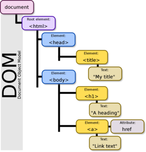

---

Author: Alain ORLUK / ID-Formation  
Formation : Développeur Web & Web mobile  
Lieu: Strasbourg
Date : 22/04/2022  

---
# **Presentation du DOM HTML et de ses APIs accessibles en JavaScript**

>**Navigation**  
>
> - [Suivant](./acces-element-selecteur-css.md#acceder-aux-elements-dans-un-document-avec-javascript-et-modifier-leur-contenu)
> - [Précédent](../valeurs-primitives-et-objets-globaux/objet-date.md#les-dates-en-javascript-et-lobjet-global-date)
> - [Menu principal](../menu.md#1-introduction-au-javascript)

Dans cette nouvelle partie, nous allons étudier le DOM ou Document Object Model, une interface grâce à laquelle nous allons pouvoir manipuler le contenu HTML et les styles de nos pages.  

C'est à partir de maintenant que votre formation JavaScript peut prendre son envol et vous dévoiler toute la magie que ce langage recèle !  
🧙‍♂️🧙‍♂️🧙‍♂️🧙‍♂️🧙‍♂️🧙‍♂️🧙‍♂️🧙‍♂️🧙‍♂️🧙‍♂️🧙‍♂️🧙‍♂️🧙‍♂️🧙‍♂️🧙‍♂️🧙‍♂️🧙‍♂️🧙‍♂️🧙‍♂️🧙‍♂️🧙‍♂️🧙‍♂️🧙‍♂️🧙‍♂️🧙‍♂️🧙‍♂️🧙‍♂️🧙‍♂️🧙‍♂️🧙‍♂️🧙‍♂️🧙‍♂️🧙

## **Présentation et définition du DOM ou Document Object Model**  

Le DOM est une interface de programmation pour des documents HTML ou XML qui représente le document (la page web actuelle) sous une forme qui permet aux langages de script comme le JavaScript d’y accéder et d’en manipuler le contenu et les styles.  

Le DOM est ainsi une représentation structurée du document sous forme « d’arbre » crée automatiquement par le navigateur.  
Chaque branche de cet arbre se termine par ce qu’on appelle un nœud qui va contenir des objets.  
On va finalement pouvoir utiliser ces objets, leurs propriétés et leurs méthodes en JavaScript.  

Le DOM contient ou correspond à un ensemble d’APIs comme l’interface `Document` par exemple qui représente une page et sert de point d’entrée dans l’arborescence du DOM.  

Pour utiliser les propriétés et méthodes de l’interface `Document`, nous allons tout simplement utiliser la propriété `document` de `Window`.  
Nous avons déjà utilisée cette propriété de nombreuses fois dans ce cours, notamment lorsqu’on souhaitait injecter du texte dans un paragraphe avec le code `document.getElementById('#').innerHTML`.  

## **Une première présentation de la structure du DOM**

Lorsqu’on demande à un navigateur d’afficher une page Web, celui-ci va automatiquement créer un modèle objet de la page ou du document.  
Ce modèle objet correspond à une autre représentation de la page sous forme d’arborescence contenant des objets qui sont de type Node (nœuds).  

Les navigateurs utilisent eux-mêmes cette arborescence qui va s’avérer très pratique à manipuler pour eux et notamment pour appliquer les styles aux bons éléments. Nous allons également pouvoir utiliser ce modèle objet en utilisant un langage de script comme le JavaScript.  

Regardez plutôt le code HTML suivant :  

```html
<!DOCTYPE html>
<html lang="en">
    <head>
        <title>My title</title>
        <meta charset="utf-8">
        <meta name="viewport"
        content="width=device-width, initial-scale=1, user-scalable=no">
    </head>
    
    <body>
        <h1>A heading</h1>
        <a href="#">Link text</a>
    </body>
</html>
```

Lorsqu’on demande au navigateur d’afficher cette page, il crée automatiquement un DOM qui ressemble à ceci :  
  
Cette structure ne doit pas vous faire peur. Le modèle objet d’un document HTML commence toujours avec l’élément html (et son doctype qui est un cas particulier).  
On parle également de « nœud » racine.  

## **Les objets Node ou nœuds du DOM**

Le terme « nœud » est un terme générique qui sert à désigner tous les objets contenus dans le DOM. A l’extrémité de chaque branche du DOM se trouve un nœud.  

A partir du nœud racine qui est le nœud `HTML` on voit que 3 branches se forment : une première qui va aboutir au nœud `HEAD`, une deuxième qui aboutit à un nœud `#text` et une troisième qui aboutit à un nœud `BODY`.  

De nouvelles branches se créent ensuite à partir des nœuds `HEAD` et `BODY` et etc.  

Comme vous pouvez le voir, cette architecture est très similaire au code de notre page (ce qui est normal puisqu’elle en est tirée), à la différence qu’on a également des nœuds « texte » mentionnés.  

Ces nœuds texte apparaissent pour deux raisons : soit parce qu’un élément contient effectivement du texte, soit parce qu’on est retourné à la ligne ou qu’on a laissé un espace entre deux éléments contenus dans l’élément `html` (aucun nœud de type texte n’est créé entre les balises ouvrantes de `html` et de `head` ni entre les balises fermantes de `body` et de `html`).  

Un caractère spécial va nous indiquer si un nœud de type texte a été constitué par une nouvelle ligne (caractère `↵`), un espace (caractère `␣`) ou du texte (caractère `#`).  

Une autre représentation du DOM peut être obtenue en inspectant la page.  
Dans cette représentation, certains navigateurs comme Chrome ne mentionnent pas les nœuds texte crées par des espaces ou des retours à la ligne dans le code car ils savent que ce ne sont que des nœuds « esthétiques » et non utiles au code.  

Vous pouvez ici retenir que chaque entité dans une page HTML va être représentée dans le DOM par un nœud.  

## **Les types de nœuds du DOM**

On va pouvoir distinguer les nœuds les uns des autres en fonction de s’il s’agit d’un nœud constitué par un texte, par un élément, par un commentaire, etc. On va pouvoir utiliser des propriétés et méthodes différentes avec chaque type de nœud puisqu’ils vont dépendre d’interfaces différentes.  

Pour être tout à fait précis, voici les différents types de nœuds que vous pourrez rencontrer et qui sont représentés par des constantes auxquelles une valeur est liée :  
|          **Constante**        |   **Valeur**   |                                             **Description**                                             |
|:-----------------------------:|:--------------:|:--------------------------------------------------------------------------------------------------------|
|         `ELEMENT_NODE`        |       `1`      |                      Représente un nœud élément (comme `p` ou `div` par exemple)>                       |
|          `TEXT_NODE`          |       `3`      |                                   Représente un nœud de type texte                                      |
|         `COMMENT_NODE`        |       `8`      |                                    Représente un nœud commentaire                                       |
|         `DOCUMENT_NODE`       |       `9`      |                           Représente le nœud formé par le document en soi                               |
|      `DOCUMENT_TYPE_NODE`     |       `10`     |                                      Représente le nœud doctype                                         |

L’un des intérêts majeurs du DOM et des nœuds va être qu’on va pouvoir se déplacer de nœuds en nœuds pour manipuler des éléments en utilisant le JavaScript.  

## **Les interfaces composant le DOM**

Ce qu’on appelle « DOM » est en fait un ensemble d’interfaces qui vont pouvoir fonctionner ensemble et nous permettre notamment d’accéder à et de manipuler divers éléments de nos documents en JavaScript.  

Pour vous donner un ordre d’idée de la complexité du DOM HTML, celui-ci est composé de plus de 40 interfaces « de base » et la plupart de ces interfaces sont-elles mêmes composées d’autres interfaces.  

Il est bien évidemment hors de question d’étudier chacune de ces interfaces en détail mais il reste bon de comprendre qu’il existe une vraie complexité derrière les outils que nous allons utiliser et que ces interfaces sont justement de merveilleux outils en soi pour cacher la complexité des opérations réalisées en arrière-plan.  

Parmi les interfaces du DOM, quelques-unes vont particulièrement nous intéresser :  

- L’interface `Window` qu’on a déjà étudié et qui est liée au DOM ;
- L’interface `Event` qui représente tout événement qui a lieu dans le DOM (nous allons définir précisément ce qu’est un évènement dans la suite de cette partie) ;
- L’interface `EventTarget` qui est une interface que vont implémenter les objets qui peuvent recevoir des évènements ;
- L’interface `Node` qui est l’interface de base pour une grande partie des objets du DOM ;
- L’interface `Document` qui représente le document actuel et qui va être l’interface la plus utilisée ;
- L’interface `Element` qui est l’interface de base pour tous les objets d’un document.  

En plus de ces interfaces incontournables, on pourra également citer les interfaces (mixin) `ParentNode`, `ChildNode`, `NonDocumentTypeChildNode`, `HTMLElement` et `NonElementParentNode` qui vont également nous fournir des propriétés et méthodes intéressantes.  

Note : Le JavaScript est un langage à héritage simple. Cela signifie qu’une interface ne peut hériter que d’une seule autre interface.  
Les mixin sont des sortes d’interfaces qui permettent de contourner cette limitation : une interface ne pourra hériter que d’une autre interface mais pourra également implémenter plusieurs mixin.  

Pour bien vous situer dans la hiérarchie du DOM et entre ces interfaces, vous pouvez retenir que :  

- L’interface `EventTarget` est l’interface parent de `Node` et donc `Node` hérite des propriétés et méthodes de l’interface `EventTarget` ;
- L’interface `Node` est le parent des interfaces `Document` et `Element` qui héritent donc de `Node` (et donc par extension également de `EventTarget`). De plus, `Document` et `Element` implémentent les mixin `ParentNode` et `ChildNode` ;
- L’interface `Element` implémente également le mixin `NonDocumentTypeChildNode` ;
- L’interface `Document` implémente également le mixin `NonElementParentNode` ;
- L’interface `HTMLElement` hérite de l’interface `Element`.  

Comme les deux interfaces `Document` et `Element` héritent de ou implémentent une grande partie des autres interfaces, ce seront souvent nos interfaces de référence à travers lesquelles nous allons utiliser la plupart des propriétés et des méthodes des interfaces citées ci-dessus.  

Dans la suite de cette partie, plutôt que de vous présenter les interfaces unes à une avec leurs propriétés et leurs méthodes, nous allons utiliser une approche plus pratique et grouper les propriétés et méthodes selon le type de données qu’elles contiennent et les opérations qu’elles permettent d’accomplir.  

Cela rendra la partie beaucoup plus dynamique et agréable à suivre que les parties Précédentes qui étaient plus théoriques et abstraites (mais qui nous ont servi à définir des bases solides et pour lesquelles il était très compliqué d’utiliser cette même approche pratique : il y a un temps pour tout !).  

>**Navigation**  
>
> - [Suivant](./acces-element-selecteur-css.md#acceder-aux-elements-dans-un-document-avec-javascript-et-modifier-leur-contenu)
> - [Précédent](../valeurs-primitives-et-objets-globaux/objet-date.md#les-dates-en-javascript-et-lobjet-global-date)
> - [Menu principal](../menu.md#1-introduction-au-javascript)
