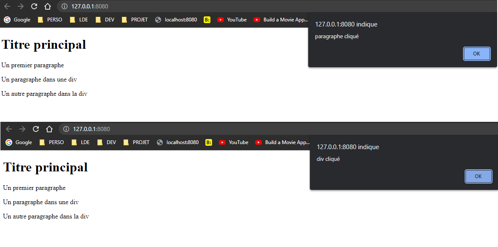

---

Author: Alain ORLUK / ID-Formation  
Formation : Développeur Web & Web mobile  
Lieu: Strasbourg
Date : 22/04/2022  

---
# **La propagation des evenements en JavaScript**

>**Navigation**  
>
> - [Suivant](./event-empecher-annuler.md#empecher-un-evenement-de-se-propager-et-annuler-son-comportement-par-defaut-en-javascript)  
> - [Précédent](./gestion-evenements.md#la-gestion-devenements-en-javascript-et-la-methode-addeventlistener)  
> - [Menu principal](../menu.md#1-introduction-au-javascript)

Plus tôt dans ce cours, nous avons dit qu’un évènement était une action qu’on pouvait détecter et à laquelle on pouvait répondre.  
Dans cette nouvelle leçon, nous allons voir en détail comment se passe cette détection et à quel moment un gestionnaire d’évènement va se déclencher.  

## **Présentation du phénomène de propagation des évènements**

Pour bien comprendre ce que signifie la propagation des évènements, nous allons nous baser sur un exemple d’évènement simple à se représenter : l’évènement `click`.  

Pour cela, nous allons créer une page avec plusieurs gestionnaires d’évènement `click` attachés à plusieurs éléments comme cela :  
`index.html`

```html
<!DOCTYPE html>
<html lang="fr">
    <head>
        <title>Présentation du phénomène de propagation des évènements</title>
        <meta charset="utf-8">
        <meta name="viewport"
        content="width=device-width, initial-scale=1, user-scalable=no">
        <script src='assets/js/main.js' async></script>
    </head>
    
    <body>
        <h1>Titre principal</h1>
        <p>Un premier paragraphe</p>
        <div id='d1'>
            <p id='d1p1'>Un paragraphe dans une div</p>
            <p id='d1p2'>Un autre paragraphe dans la div</p>
        </div>
    </body>
</html>
```

`main.js`

```js
// On sélectionne les éléments du document avec les ids d1 et d1p1
let d1 = document.querySelector('#d1');
let d1p1 = document.querySelector('#d1p1');

d1.addEventListener('click', function () {
    alert('div cliqué')
});
d1p1.addEventListener('click', function () {
    alert('paragraphe cliqué')
});
```

Notre document HTML possède ici un élément `div` qui contient lui-même deux éléments `p`.  
On attache un gestionnaire d’évènement `click` à la `div` ainsi qu’au premier élément `p` de cette `div`.  

Lorsqu’un utilisateur clique sur le premier paragraphe dans la `div`, à priori, les deux gestionnaires d’évènement vous s’exécuter.  
Ici, la question est de savoir dans quel ordre ils vont se déclencher.  

Pour répondre à cette question, il suffit de faire le test et de cliquer sur le paragraphe.  
Le résultat obtenu est le suivant :  

Comme on peut le constater, le gestionnaire d’évènement lié au paragraphe se déclenche avant celui lié à la `div`.  
Pour comprendre pourquoi, il faut comprendre les concepts de propagation des évènements, de phase de capture et de phases de bouillonnement.  

## **Les phases de capture et de bouillonnement**

Lorsqu’un évènement se déclenche, celui-ci va en fait naviguer à travers le DOM et passer à travers les différents gestionnaires d’évènement disposés dans le document.  
On dit également que l’évènement se « propage » dans le DOM.  

Cette propagation va se faire selon différentes phases qu’on appelle phase de capture et phase de bouillonnement.  

Ici, vous devez bien comprendre qu’un évènement (représenté en JavaScript par un objet) va toujours suivre le même chemin en JavaScript : il va toujours se propager en partant de l’ancêtre le plus lointain par rapport à la cible de l’évènement jusqu’à la cible de l’évènement puis faire le chemin inverse.  

Par exemple, lorsqu’un utilisateur clique sur le paragraphe de notre exemple Précédent, ce paragraphe est la cible de l’évènement.  

L’évènement `click` va se propager en partant de l’ancêtre le plus lointain du paragraphe, c’est-à-dire en partant de l’élément `html` puis en traversant les ancêtres de l’élément `p` un à un (`body` puis `div`) jusqu’à arriver à cet élément `p`.  

Une fois arrivé à l’élément `p`, l’objet évènement va faire le chemin inverse et remonter dans l’arborescence du DOM de cet élément `p` jusqu’à l’ancêtre le plus lointain, c’est-à-dire traverser l’élément `div`, puis l’élément `body`, puis finalement l’élément `html`.  

Cette première phase de descente dans l’arbre du DOM est ce qu’on appelle la phase de capture.  
La deuxième phase de remontée est appelée phase de bouillonnement.  

Ici, une chose devrait vous interpeller : si la phase de capture se passe avant la phase de bouillonnement, l’évènement devrait atteindre le gestionnaire d’évènement de la `div` avant celui du paragraphe et donc celui-ci devrait se déclencher en premier alors pourquoi est-ce le contraire qui s’est passé dans l’exemple Précédent ?  

Cela est dû au fait que les gestionnaires d’évènements sont par défaut configurés pour ne s’exécuter (ou pour ne « répondre ») que dans la phase de bouillonnement et pour ignorer la phase de capture.  

Vous pourriez alors vous poser la question suivante : pourquoi avoir implémenté deux phases différentes si tous les évènements utilisent par défaut la phase de bouillonnement ?  

Comme souvent, la réponse est la suivante : les raisons sont historiques.  
En effet, vous devez bien comprendre que chaque langage de programmation porte avec lui un bagage historique.  
Ce bagage historique provient de deux grands facteurs : des choix faits précédemment dans la structure du langage et sur lesquels les créateurs sont revenus aujourd’hui (le mot-clé `var` abandonné au profit de `let` par exemple) et la résolution des anciens problèmes de compatibilité entre les navigateurs (en effet, le temps n’est pas si loin où chaque navigateur majeur implémentait une même fonctionnalité différemment.  

Dans le cas des phases de capture et de bouillonnement, on doit cela au fait qu’à l’époque certains navigateurs utilisaient la phase de capture et d’autres utilisaient la phase de bouillonnement.  
Quand le W3C a décidé d’essayer de normaliser le comportement et de parvenir à un consensus, ils en sont arrivés à ce système qui inclue les deux.  

## **Choisir la phase de déclenchement d’un gestionnaire d’évènements**

Aujourd’hui, nous disposons d’un système avec deux phases de propagation des évènements : une première phase de capture et une deuxième phase de bouillonnement.  
Les gestionnaires d’évènements se déclenchent par défaut durant la phase de bouillonnement.  

Il existe cependant des outils qui nous permettent de modifier ce comportement par défaut et de faire en sorte qu’un gestionnaire se déclenche durant la phase de capture.  
Vous pouvez déjà noter qu’en pratique, cependant, on n’utilisera pas ce genre d’outils sans une bonne raison car cela revient à réintroduire une complexité du passé alors qu’un effort d’uniformisation a été fait durant ces dernières années pour nous simplifier la vie.  

Pour choisir dans quelle phase un gestionnaire d’évènement doit se déclencher, nous allons pouvoir passer un troisième argument booléen à la méthode `addEventListener()`.  

Par défaut, la valeur de cet argument est `false` ce qui indique que le gestionnaire d’évènement doit ignorer la phase de capture.  
Pour lui demander de réagir à la phase de capture, on va donc devoir lui passer la valeur `true`.  

Par défaut, si un gestionnaire est configuré pour réagir à la phase de capture, alors le phase de bouillonnement sera ignorée par ce même gestionnaire.  Cela signifie qu’un gestionnaire ne s’exécutera qu’une seule fois dans tous les cas, ce qui est généralement le comportement voulu.  
`index.html`

```html
<!DOCTYPE html>
<html lang="fr">
    <head>
        <title>Choisir la phase de déclenchement d’un gestionnaire d’évènements</title>
        <meta charset="utf-8">
        <meta name="viewport"
        content="width=device-width, initial-scale=1, user-scalable=no">
        <script src='assets/js/main.js' async></script>
    </head>
    
    <body>
        <h1>Titre principal</h1>
        <p>Un premier paragraphe</p>
        <div id='d1'>
            <p id='d1p1'>Un paragraphe dans une div</p>
            <p id='d1p2'>Un autre paragraphe dans la div</p>
        </div>
    </body>
</html>
```

`main.js`

```js
// On sélectionne les éléments du document avec les ids d1 et d1p1
let d1 = document.querySelector('#d1');
let d1p1 = document.querySelector('#d1p1');

// On utilise la phase de capture
d1.addEventListener('click', function () {
    alert('div cliqué')
}, true);
d1p1.addEventListener('click', function () {
    alert('paragraphe cliqué')
}, true);
```

>**Navigation**  
>
> - [Suivant](./event-empecher-annuler.md#empecher-un-evenement-de-se-propager-et-annuler-son-comportement-par-defaut-en-javascript)  
> - [Précédent](./gestion-evenements.md#la-gestion-devenements-en-javascript-et-la-methode-addeventlistener)  
> - [Menu principal](../menu.md#1-introduction-au-javascript)
