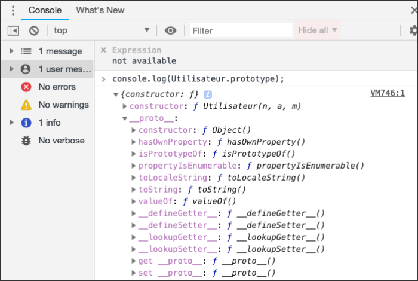
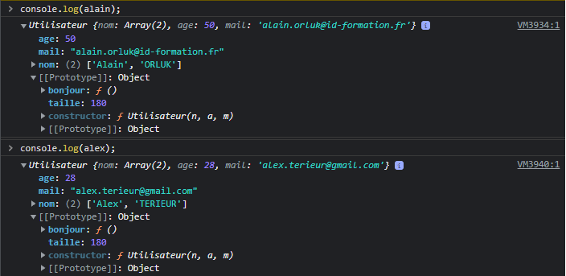

---

Author: Alain ORLUK / ID-Formation  
Formation : Développeur Web & Web mobile  
Lieu: Strasbourg
Date : 22/04/2022  

---
# **Constructeur Object, prototype et heritage en JavaScript**

>**Navigation**  
>
> - [Suivant](./classes.md#les-classes-en-javascript)
> - [Précédent](./definition-creation-constructeur.md#definition-et-creation-dun-constructeur-dobjets-en-javascript)
> - [Menu principal](../menu.md#1-introduction-au-javascript)

Dans cette nouvelle leçon, nous allons définir ce qu’est un prototype et comprendre comment le JavaScript utilise les prototypes pour permettre à certains d’objets d’avoir accès aux méthodes et propriétés définies dans d’autres objets.  

## **L’utilisation d’un constructeur et la performance**

Dans la leçon Précédente, nous avons pu créer plusieurs objets semblables en appelant plusieurs fois une fonction constructeur personnalisée `Utilisateur()` et en utilisant le mot-clé `new` comme ceci :  

```js
// Utilisateur() est une fonction constructeur
function Utilisateur(n, a, m) {
    this.nom = n;
    this.age = a;
    this.mail = m;

    this.bonjour = function() {
        alert(`Bonjour, je suis ${this.nom[0]}, j'ai ${this.age} ans`);
    }
}

// On crée 2 objets alain et alex en utilisant le constructeur
let alain = new Utilisateur(['Alain', 'ORLUK'], 50, 'alain.orluk@id-formation.fr');
let alex = new Utilisateur(['Alex', 'TERIEUR'], 28, 'alex.terieur@gmail.com');
```

Ici, on commence par définir une fonction constructeur puis on crée deux variables qui vont stocker deux objets créés à partir de ce constructeur.  
En procédant comme cela, chaque objet va disposer de sa propre copie des propriétés et méthodes du constructeur ce qui signifie que chaque objet créer va posséder trois propriétés `nom`, `age` et `mail` et une méthode `bonjour()` qui va lui appartenir.  

L’équivalent de cette écriture sous forme d’objet littéral serait la suivante :  

```js
// On crée 2 objets littéraux
let alain = {
    nom : ['Alain', 'ORLUK'],
    age : 50,
    mail : 'alain.orluk@id-formation.fr',
    bonjour : function() {
        alert(`Bonjour, je suis ${this.nom[0]}, j'ai ${this.age} ans`);
    }
};
let alex = {
    nom : ['Alex', 'TERIEUR'],
    age : 28,
    mail : 'alex.terieur@gmail.com',
    bonjour : function() {
        alert(`Bonjour, je suis ${this.nom[0]}, j'ai ${this.age} ans`);
    }
};
```

L’un des enjeux principaux en tant que développeurs doit toujours être la performance de nos codes.  
Dans le cas présent, notre code n’est pas optimal puisqu’en utilisant notre constructeur plusieurs fois on va copier à chaque fois la méthode `bonjour()` qui est identique pour chaque objet.  

Ici, l’idéal serait de ne définir notre méthode qu’une seule fois et que chaque objet puisse l’utiliser lorsqu’il le souhaite.  
Pour cela, nous allons recourir à ce qu’on appelle des prototypes.  

## **Le prototype en JavaScript orienté objet**

Le JavaScript est un langage orienté objet basé sur la notion de prototypes.  

Vous devez en effet savoir qu’il existe deux grands types de langages orientés objet : ceux basés sur les classes, et ceux basés sur les prototypes.  

La majorité des langages orientés objets sont basés sur les classes et c’est souvent à cause de cela que les personnes ayant déjà une certaine expérience en programmation ne comprennent pas bien comme fonctionne l’orienté objet en JavaScript.  

En effet, les langages objets basés sur les classes et ceux basés sur les prototypes vont fonctionner différemment.  

Pour information, une classe est un plan général qui va servir à créer des objets similaires. Une classe va généralement contenir des propriétés, des méthodes et une méthode constructeur.  

Cette méthode constructeur va être appelée automatiquement dès qu’on va créer un objet à partir de notre classe et va nous permettre dans les langages basés sur les classes à initialiser les propriétés spécifiques des objets qu’on crée.  

Dans les langages orientés objet basés sur les classes, tous les objets sont créés à partir de classes et vont hériter des propriétés et des méthodes définies dans la classe.  

Dans les langages orientés objet utilisant des prototypes comme le JavaScript, tout est objet et il n’existe pas de classes et l’héritage va se faire au moyen de prototypes.  

Ce qui va suivre n’est pas forcément évident à se représenter mais est néanmoins essentiel pour bien maitriser le JavaScript orienté objet. Soyez donc bien attentif.  

Avant tout, je tiens à vous rappeler que les fonctions en JavaScript sont avant tout des objets. Lorsqu’on créé une fonction, le JavaScript va automatiquement lui ajouter une propriété `prototype` qui ne va être utile que lorsque la fonction est utilisée comme constructeur, c’est-à-dire lorsqu’on l’utilise avec la syntaxe `new`.  

Cette propriété `prototype` possède une valeur qui est elle-même un objet. On parlera donc de « prototype objet » ou « d’objet prototype » pour parler de la propriété `prototype`.  

Par défaut, la propriété `prototype` d’un constructeur ne contient que deux propriétés : une propriété `constructor` qui renvoie vers le constructeur contenant le prototype et une propriété `__proto__` qui contient elle-même de nombreuses propriétés et méthodes.  
  
Lorsqu’on crée un objet à partir d’un constructeur, le JavaScript va également ajouter automatiquement une propriété `__proto__` à l’objet créé.  

La propriété `__proto__` de l’objet créé va être égale à la propriété `__proto__` du constructeur qui a servi à créer l’objet.  

A quoi servent la propriété `prototype` d’un constructeur et la propriété `__proto__` dont disposent à la fois le constructeur mais également tous les objets créés à partir de celui-ci ?  

En fait, le contenu de la propriété `prototype` d’un constructeur va être partagé par tous les objets créés à partir de ce constructeur.  
Comme cette propriété est un objet, on va pouvoir lui ajouter des propriétés et des méthodes que tous les objets créés à partir du constructeur vont partager.  

Cela permet l’héritage en orienté objet JavaScript. On dit qu’un objet « hérite » des membres d’un autre objet lorsqu’il peut accéder à ces membres définis dans l’autre objet.  

En l’occurrence, ici, les objets crées à partir du constructeur ne possèdent pas vraiment les propriétés et les méthodes définies dans la propriété `prototype` du constructeur mais vont pouvoir y accéder et se « partager » ces membres définis dans l’objet `prototype` du constructeur.  

Pour faire fonctionner cela en pratique, il faut se rappeler que la propriété `prototype` est un objet et qu’on va donc pouvoir lui ajouter des propriétés et des méthodes comme pour tout autre objet. Regardez plutôt l’exemple ci-dessous :  

```js
// Utilisateur() est une fonction constructeur
function Utilisateur(n, a, m) {
    this.nom = n;
    this.age = a;
    this.mail = m;
}

/* On ajoute des propriétés et méthodes au prototype de Utilisateur de la même
façon que pour n'importe quel objet */
Utilisateur.prototype.taille = 180;
Utilisateur.prototype.bonjour = function () {
    alert(`Bonjour, je suis ${this.nom[0]}, j'ai ${this.age} ans`);
};

// On crée 2 objet alain et alex en utilisant le constructeur
let alain = new Utilisateur(['Alain', 'ORLUK'], 50, 'alain.orluk@id-formation.fr');
let alex = new Utilisateur(['Alex', 'TERIEUR'], 28, 'alex.terieur@gmail.com');
```

Ici, on ajoute une propriété `taille` et une méthode `bonjour()` à la propriété `prototype` du constructeur `Utilisateur()`.  
Chaque objet créé à partir de ce constructeur va avoir accès à cette propriété et à cette méthode.  

  
Définir des propriétés et des méthodes dans le prototype d’un constructeur nous permet ainsi de les rendre accessible à tous les objets créés à partir de ce constructeur sans que ces objets aient à les redéfinir.  

Pour avoir le code le plus clair et le plus performant possible, nous définirons donc généralement les propriétés des objets (dont les valeurs doivent être spécifiques à l’objet) au sein du constructeur et les méthodes (que tous les objets vont pouvoir appeler de la même façon) dans le prototype du constructeur.  

Ce que vous devez bien comprendre ici est que les différents objets se « partagent » ici la même propriété `taille` et la même méthode `bonjour()` définies dans le constructeur.  

Pour bien comprendre comment cela est possible, il va falloir comprendre le rôle de la propriété `__proto`.  

## **La chaine des prototypes ou chaine de prototypage et l’objet Object**

Comment un objet peut-il accéder à une propriété ou à une méthode définie dans un autre objet ?  

Pour répondre à cette question, il faut savoir que lorsqu’on essaie d’accéder à un membre d’un objet, le navigateur (qui exécute le JavaScript) va d’abord chercher ce membre au sein de l’objet.  

S’il n’est pas trouvé, alors le membre va être cherché au sein de la propriété `__proto__` de l’objet dont le contenu est, rappelons-le, égal à celui de la propriété `prototype` du constructeur qui a servi à créer l’objet.  

Si le membre est trouvé dans la propriété `__proto__` de l’objet (c’est-à-dire s’il a été défini dans la propriété `prototype` du constructeur), alors il est utilisé. Si ce n’est pas le cas, alors on va aller chercher dans la propriété `__proto__` dont dispose également le constructeur et qui va être égale au `prototype` du constructeur du constructeur.  

On dit alors qu’on « remonte la chaine des prototypes ». A ce niveau, il faut savoir que tous les objets en JavaScript descendent par défaut d’un objet de base qui s’appelle `Object`.  

Cet objet est l’un des objets JavaScript prédéfinis et permet notamment de créer des objets génériques vides grâce à la syntaxe `new Object()`.  

L’objet ou le constructeur `Object()` va être le parent de tout objet en JavaScript (sauf certains objets particuliers créés intentionnellement pour ne pas dépendre d’`Object`) et également posséder une propriété `prototype`.  

Ainsi, lorsqu’on essaie d’accéder à un membre d’un objet, le membre en question sera d’abord cherché dans l’objet puis dans sa propriété `__proto__` s’il n’est pas trouvé dans l’objet puis dans la propriété `__proto__` de son constructeur et etc. jusqu’à remonter au constructeur `Object()`.  

Si finalement le membre demandé n’est pas trouvé dans le constructeur `Object()`, alors il sera considéré comme non présent.  

Comprendre cela va nous permettre de créer des hiérarchies d’objets et notamment de mettre en place un héritage en orienté objet JavaScript.  

## **Mise en place d’une hiérarchie d’objets avec héritage en JavaScript**

Lorsqu’on a compris comment le JavaScript utilise le prototypage, on est capable de créer une hiérarchie d’objets avec des objets qui héritent des membres d’autres objets.  

Quel intérêt à faire cela ? Parfois, nous voudrons créer des types d’objets relativement proches.  
Plutôt que de redéfinir un constructeur entièrement à chaque fois, il va être plus judicieux de créer un constructeur de base qui va contenir les propriétés et méthodes communes à tous nos objets puis des constructeurs plus spécialisés qui vont hériter de ce premier constructeur.  

Attention, à partir d’ici, on commence à toucher à des choses vraiment complexes et qui sont difficiles à assimiler et dont l’intérêt est dur à percevoir en particulier pour des débutants.  

Pour autant, ces mécanismes sont au cœur du JavaScript et sont ce qui fait toute sa puissance.  
Il est donc essentiel de les comprendre tôt ou tard pour utiliser tout le potentiel du JavaScript.  

Pour mettre en place un héritage ou plus exactement un système de délégation (qui est un mot beaucoup plus juste que le terme « héritage » dans le cas du JavaScript), nous allons toujours procéder en trois étapes :  

- On va déjà créer un constructeur qui sera notre constructeur parent ;
- On va ensuite un constructeur enfant qui va appeler le parent ;
- On va modifier la `__proto__` de la propriété `prototype` de l’enfant pour qu’elle soit égale au parent.  

Prenons immédiatement un exemple pratique :  
`index.html`

```html
<!DOCTYPE html>
<html lang="fr">
    <head>
        <title>Utiliser le point pour accéder aux membres d’un objet, les modifier ou en définir de nouveaux</title>
        <meta charset="utf-8">
        <meta name="viewport"
        content="width=device-width, initial-scale=1, user-scalable=no">
        <script src='assets/js/main.js' async></script>
    </head>
    
    <body>
        <h1>Titre principal</h1>
        <p>Un paragraphe</p>
        <p id='p1'></p>
        <p id='p2'></p>
        <p id='p3'></p>
    </body>
</html>
```

`main.js`

```js
function Ligne(longueur){
    this.longueur = longueur;
}
Ligne.prototype.taille = function(){
    document.getElementById('p1').innerHTML = 'Longueur : ' + this.longueur};

function Rectangle(longueur, largeur){
    Ligne.call(this, longueur);
    this.largeur = largeur;
}
Rectangle.prototype = Object.create(Ligne.prototype);
Rectangle.prototype.constructor = Rectangle;
Rectangle.prototype.aire = function(){
    document.getElementById('p2').innerHTML =
    'Aire : ' + this.longueur * this.largeur};

function Parallelepipede(longueur, largeur, hauteur){
    Rectangle.call(this, longueur, largeur);
    this.hauteur = hauteur;
}
Parallelepipede.prototype = Object.create(Rectangle.prototype);
Parallelepipede.prototype.constructor = Parallelepipede;
Parallelepipede.prototype.volume = function(){
    document.getElementById('p3').innerHTML =
    'Volume : ' + this.longueur * this.largeur * this.hauteur};

let geo = new Parallelepipede(5, 4, 3);
geo.volume();
geo.aire();
geo.taille();
```

Ce code semble complexe à première vue. Il l’est.😂😂  
Nous allons tenter de l’expliquer et de le décortiquer ligne par ligne.  

Dans ce script, nous définissons 3 constructeurs : `Ligne()`, `Rectangle()` et `Parallelepipede()`. Ici, on veut que `Rectangle()` hérite de `Ligne()` et que `Parallelepipede()` hérite de `Rectangle()` (et donc par extension de `Ligne()`.  

Notre premier constructeur `Ligne()` possède une propriété `longueur`. Ce constructeur prend en argument la valeur relative à la propriété `longueur` d’un objet en particulier lorsqu’on crée un objet à partir de celui-ci.  

On ajoute ensuite une première méthode dans le prototype de notre constructeur. Cette méthode appartient au constructeur et sera partagée par tous les objets créés à partir de celui-ci. Jusque-là, c’est du déjà vu.  

On crée ensuite un deuxième constructeur `Rectangle()`.  
Dans ce constructeur, vous pouvez remarquer la ligne `Ligne.call(this, longueur);`.  

Pour information, la méthode `call()` permet d’appeler une fonction rattachée à un objet donné sur un autre objet. La méthode `call()` est une méthode prédéfinie qui appartient au prototype de l’objet natif `Function`.  

On l’utilise ici pour faire appel au constructeur `Ligne()` dans notre constructeur `Rectangle()`.  
Le mot-clé this permet de faire référence à l’objet courant et de passer la valeur de l’objet relative à sa propriété longueur.  

Ensuite, on va créer un objet en utilisant le prototype de `Ligne` grâce à la méthode `create()` qui est une méthode de l’objet `Object()` et on va assigner cet objet au prototype de `Rectangle`.  

Le prototype de `Rectangle` possède donc en valeur un objet créé à partir du prototype de `Ligne`. Cela permet à `Rectangle` d’hériter des propriétés et méthodes définies dans le prototype de `Ligne`.  

Il nous reste cependant une chose à régler ici : il va nous falloir rétablir la valeur de la propriété `constructor` de `prototype` de `Rectangle` car la ligne Précédente a eu pour effet de définir `Rectangle.prototype.constructor` comme étant égal à celui de `Ligne()`.  

On ajoute finalement une méthode `aire()` au prototype de `Rectangle`.  

On répète l’opération en création un deuxième niveau d’héritage avec le constructeur `Parallélépipède()` qui va hériter de `Rectangle()`.  

Enfin, on crée un objet `geo` à partir du constructeur `Parallélépipède()`. Cet objet va pouvoir utiliser les méthodes définies dans les prototypes de `Parallélépipède()`, de `Rectangle()` et de `Ligne()` !  

Je vous rassure : ce script était l’un des plus durs voire peut être le plus dur à comprendre de ce cours.  

>**Navigation**  
>
> - [Suivant](./classes.md#les-classes-en-javascript)
> - [Précédent](./definition-creation-constructeur.md#definition-et-creation-dun-constructeur-dobjets-en-javascript)
> - [Menu principal](../menu.md#1-introduction-au-javascript)
