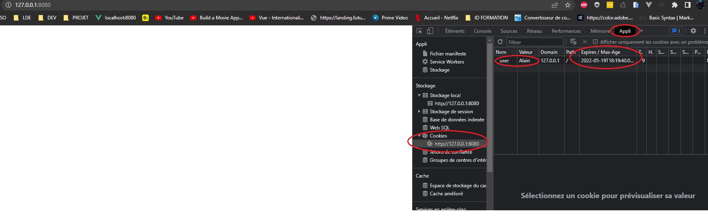

---

Author: Alain ORLUK / ID-Formation  
Formation : Développeur Web & Web mobile  
Lieu: Strasbourg
Date : 18/05/2022  

---
# **Les cookies en JavaScript**

>**Navigation**  
>
> - [Suivant](./api-web-storage.md#lapi-web-storage--localstorage-et-sessionstorage-en-javascript)  
> - [Précédent](../asynchrone/chemin-critique-async-defer.md#le-chemin-critique-du-rendu-et-les-attributs-html-async-et-defer)  
> - [Menu principal](../menu.md#1-introduction-au-javascript)

À présent, nous allons voir ce que sont les cookies et comment créer, modifier ou supprimer des cookies en JavaScript.  

## **Qu’est-ce qu’un cookie et quel est l’int&eacute;r&ecirc;t d’un cookie ?**

Un cookie est un petit fichier qui ne contient généralement qu’une seule donnée et qui va être stocké directement dans le navigateur d’un utilisateur.  

Le plus souvent, les cookies sont mis en place (créés) côté serveur et vont être envoyés avec une page lorsque l’utilisateur demande à y accéder.  

Les cookies sont très pratiques car ils permettent de conserver des informations envoyées par l’utilisateur et donc de pouvoir s’en resservir et cela de manière relativement simple.  

Les cookies vont nous permettre d’enregistrer des informations à propos de l’utilisateur comme une liste de préférences indiquées (par exemple : « je préfère que ce site utilise son thème foncé » ou « je ne souhaite plus voir ce message ») ou vont encore notamment pouvoir servir aux utilisateurs à se connecter plus facilement à un site en gardant en mémoire leurs informations de connexion.  

Expliquons immédiatement ce qu’il se passe dans ce dernier cas.  
Pour cela, imaginons que nous possédions un site sur lequel les utilisateurs peuvent s’enregistrer.  
La première fois qu’un utilisateur cherche à accéder à la page de connexion, le navigateur contacte le serveur qui renvoie la page et renvoie également un cookie qui va être stocké dans le navigateur du visiteur et qui va enregistrer ses informations de connexion.  

L’utilisateur s’enregistre puis se déconnecte ensuite du site.  
Le lendemain, il revient sur notre site.  
Cette fois-ci, le navigateur va, en plus de demander au serveur d’envoyer la page, envoyer le cookie avec les informations de connexion.  
Ainsi, le serveur va pouvoir identifier l’utilisateur et le connecter automatiquement au site.  

## **Un cookie est-il dangereux ?**

Contrairement aux idées reçues, les cookies ne sont pas dangereux en soi : ce ne sont que des petits fichiers stockant une information.  

En revanche, le danger réside dans la gestion des cookies par l’utilisateur.  
En effet, rappelons que les cookies sont toujours stockés dans le navigateur de nos visiteurs.  
Nous n’y avons donc jamais directement accès et c’est l’utilisateur qui va décider quels cookies il va accepter et lesquels il va refuser.  

L’autre danger des cookies réside dans le cas où un programme malveillant arrive à intercepter des cookies et donc les informations parfois sensibles qu’ils contiennent.  
Cela peut arriver dans le cas où un utilisateur se fait duper ou dans le cas d’une attaque contre notre site.  

Quoiqu’il en soit, aujourd’hui, quasiment tous les sites utilisent des cookies car ces derniers apportent une réelle aisance de navigation pour les visiteurs et permettent à de nombreux programmes de fonctionner plus rapidement.  

L’enjeu pour nous va être de sécuriser notre site et de faire attention aux différentes informations demandées et à l’utilisation de ces informations.  

## **Obtenir la liste des cookies et cr&eacute;er un cookie en JavaScript**

Bien que la majorité des cookies sont initiés côté serveur, on va également pouvoir créer des cookies côté client grâce au JavaScript.  
Pour cela, on va utiliser le descripteur d’accesseur `document.cookie`.  

Un descripteur d’accesseur est une propriété décrite par une paire d’accesseur/mutateur (getter/setter) qui sont des fonctions.  

Le descripteur d’accesseur ou la « propriété accesseur » `document.cookie` possède une paire de fonctions getter et setter natives.  
Cela signifie simplement qu’on va pouvoir accéder aux cookies et écrire de nouveaux cookies avec `document.cookie` sans impacter les cookies déjà créés.  

Pour créer un cookie, il va à minima falloir lui passer un nom et une valeur comme ceci :  

```js
document.cookie = 'user=Alain'; //Crée ou met à jour un cookie 'user'
```

Pour obtenir la liste des cookies relatifs au domaine, nous allons à nouveau utiliser `document.cookie` sans fournir de valeur comme ceci :  

```js
document.cookie = 'user=Alain'; // Crée ou met à jour un cookie 'user'
alert(document.cookie); // Affiche la liste des cookies
```

Note : si vous tentez d’exécuter ce code directement dans votre navigateur sans passer par un serveur (live server, Apache ou autre), aucun cookie ne sera créé.  

## **Les options des cookies**

En plus d’une paire nom=valeur, on va également pouvoir définir des options pour nos cookies comme leur domaine de validité ou encore leur date d’expiration (aucun cookie n’est stocké définitivement dans un navigateur).  

### **La port&eacute;e des cookies : chemin (r&eacute;pertoire) et domaine d’accessibilit&eacute;**

On va déjà pouvoir préciser un répertoire dans lequel le cookie est accessible avec l’option `path`.  
Le chemin fourni doit être absolu. Par défaut, un cookie est accessible dans la page courante.  

Par exemple, un cookie défini avec `path =/regularisation` sera disponible dans les pages `/regularisation` et `/regularisation/…` mais pas dans les pages `/accueil` ou `/gestion_parent`.  

Généralement, on écrira `path =/` pour rendre le cookie accessible à partir de toutes les pages du site Web, c’est-à-dire sur l’ensemble du domaine ou du sous domaine.  

```js
// Crée ou met à jour un cookie 'user'
document.cookie = 'user=Alain; path=/';
```

L’option `domain` permet de préciser le domaine sur lequel le cookie doit être accessible.  

Par défaut, un cookie est disponible dans le domaine ou dans le sous domaine dans lequel il a été créé uniquement mais pas dans les autres sous domaines.  

Notez que cette option est limitée à l’ensemble du domaine principal et des sous domaines dans lequel le cookie a été créé et ceci pour des raisons de sécurité évidentes.  

Par exemple, si je crée un cookie pour la page id-formation.com sans préciser de domaine, le cookie sera disponible dans le domaine id-formation.com mais pas dans un sous domaine intranet.id-formation.com ni sur un autre domaine.  

Si je mentionne explicitement domain=id-formation.com lors de la création du cookie, en revanche, mon cookie sera disponible sur le domaine et sur l’ensemble des sous domaines liés à id-formation.com.  

```js
// Crée ou met à jour un cookie 'user'
document.cookie = 'user=Alain; path=/; domain=id-formation.com';
// Ici, si vous souhaitez tester, il vous faudra supprimer l'option domain pour que le cookie soit crée sur localhost (serveur local live-server)
```



### **L’&acirc;ge maximal et la date d’expiration des cookies**

Par défaut, un cookie est supprimé dès que le navigateur est fermé.  
L’option `expires` permet de préciser une date d’expiration pour un cookie, afin de faire en sorte qu’un cookie soit conservé plus longtemps pour pouvoir être réutilisé dans le futur.  

Pour que cette option fonctionne correctement, il faudra bien fournir un format de date spécifique et avec le fuseau horaire GMT.  
On peut utiliser la méthode `toUTCString()` de l’objet `Date` pour s’assurer que notre date possède la bon format.  

On va ainsi par exemple pouvoir définir un cookie qui devra expirer (être supprimé) exactement 24h après sa création comme cela :  

```js
let date = new Date(Date.now() + 86400000); // 86400000 millisecondes = 1 jour
date = date.toUTCString();

// Crée ou met à jour un cookie 'user'
document.cookie = 'user=Alain; path=/; domain=id-formation.com; expires=' + date;
// Ici, si vous souhaitez tester, il vous faudra supprimer l'option domain pour que le cookie soit crée sur localhost (serveur local live-server)
```

Notez qu’on peut également utiliser l’option `max-age` pour définir la date d’expiration d’un cookie **en secondes** à partir du moment actuel.  
Cette option est une alternative à `expires` qui nous permet d’utiliser des nombres.  

```js
// Crée ou met à jour un cookie 'user'
document.cookie = 'user=Alain; path=/; domain=id-formation.com; max-age=86400';
```

### Les cookies et la s&eacute;curit&eacute;

L’option `secure` permet d’indiquer qu’un cookie doit être envoyé uniquement via HTTPS et ne pas l’être via HTTP.  
Cette option est très utile si un cookie possède des données sensibles qui ne doivent pas être envoyées sans encryptage.  

```js
// Crée ou met à jour un cookie 'user'
document.cookie = 'user=Alain; path=/; domain=id-formation.com; secure';
```

L’option `samesite` empêche le navigateur d’envoyer un cookie lors d’une requête cross-site.  
Cette option offre une bonne protection contre les attaques de type XSRF (cross-site request forgery).  

Pour comprendre comment fonctionne ce type d’attaques et à quoi sert l’option `samesite`, considérons l’exemple suivant.  Imaginons que vous soyez connecté à un site marchand et que vous possédiez donc un cookie qui sert à vous identifier stocké dans votre navigateur.  

Vous ouvrez un second onglet et allez sur un autre site. Ce site est un site malveillant qui possède un formulaire.  
Ce formulaire est directement envoyé sur le site marchand (en précisant son adresse via l’attribut `action`) et ses champs ont pour but de vous faire acheter quelque chose sur le premier site marchand.  

Lorsque vous validez le formulaire, celui-ci est directement envoyé sur le site marchand et votre navigateur envoie également votre cookie d’identification puisque celui-ci est envoyé à chaque fois que vous visitez ce site.  
Le site marchand vous identifie donc automatiquement et votre achat est effectué sans que vous ne l’ayez voulu.  
C’est le principe d’une attaque de type cross-site request forgery.  

L’option `samesite` permet de se prémunir contre ce type d’attaque. Pour cela, on va pouvoir choisir parmi l’une de ces deux valeurs :  

- `samesite="strict"` indique qu’un cookie ne doit jamais être envoyé si l’utilisateur arrive sur le site depuis un autre site ;
- `samesite="lax"` possède les mêmes caractéristiques que la valeur `strict` à la différence que les cookies provenant de requêtes de type `get` de navigation top level (requêtes qui modifient l’URL dans la barre d’adresse du navigateur) seront envoyés.

```js
// Crée ou met à jour un cookie 'user'
document.cookie = 'user=Alain; path=/; domain=id-formation.com; samesite=lax';
```

## Cookies JavaScript et HttpOnly

L’option `httpOnly` ne depend pas du JavaScript mais va avoir un effet important sur l’utilisation des cookies en JavaScript et nous devons donc la mentionner ici.  

Ici, vous devez savoir que le serveur utilise un en-tête (header) `Set-Cookie` pour définir un cookie.  
En définissant le cookie, il va également pouvoir ajouter une option `httpOnly`.  

Cette option interdit tout simplement tout accès au cookie au JavaScript.  
Nous ne pouvons pas voir ce cookie ni le manipuler avec `document.cookie`.  

Cette option est utilisée pour se prémunir d’attaques XSS (cross-site scripting), qui sont des attaques qui reposent sur l’injection de code JavaScript dans une page avec l’intention que l’utilisateur ou que le site lui-même exécute ce code qui va pouvoir récupérer des informations ou créer des dégâts sur le site.  

## Modifier ou supprimer un cookie en JavaScript

Pour modifier un cookie, il suffit de le réécrire avec le même nom et en changeant les autres informations.  

Notez qu’on ne va pas pouvoir changer le nom d’un cookie : si l’on change de nom, cela sera considéré comme un autre cookie et ça n’effacera pas le premier.  

Pour supprimer un cookie, la méthode la plus simple est de le réécrire sans valeur et en précisant cette fois-ci une date d’expiration passée.  

```js
let date = new Date(Date.now() + 86400000); //86400000ms = 1 jour
date = date.toUTCString();

// Crée ou met à jour un cookie 'user'
document.cookie = 'user=Alain; path=/; expires=' + date; 

// Supprime le cookie en lui passant une date d'expiration passée
document.cookie = 'user=; path=/; expires=Tue, 17 May 2022 00:00:00 UTC';
```

>**Navigation**  
>
> - [Suivant](./api-web-storage.md#lapi-web-storage--localstorage-et-sessionstorage-en-javascript)  
> - [Précédent](../asynchrone/chemin-critique-async-defer.md#le-chemin-critique-du-rendu-et-les-attributs-html-async-et-defer)  
> - [Menu principal](../menu.md#1-introduction-au-javascript)
