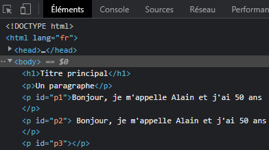

---

Author: Alain ORLUK / ID-Formation  
Formation : Développeur Web & Web mobile  
Lieu: Strasbourg
Date : 22/04/2022  

---
# **L’objet global JavaScript String, proprietes et methodes**

>**Navigation**  
>
> - [Suivant](./objet-number.md#lobjet-global-javascript-number-proprietes-et-methodes)
> - [Précédent](../valeurs-primitives-et-objets-globaux/presentation.md#valeurs-primitives-et-objets-predefinis-en-javascript)
> - [Menu principal](../menu.md#1-introduction-au-javascript)  

L’objet `String` gère les chaînes de caractères. Le constructeur `String()` possède deux propriétés et une trentaine de méthodes.  
Comme nous l’avons vu précédemment, nous n’utiliserons pas la fonction constructeur de cet objet pour créer de nouveaux objets de type string : on préfèrera en effet utiliser des valeurs primitives qui sont plus performantes et avec lesquelles on va également pouvoir utiliser les propriétés et méthodes définies dans le constructeur.  

## **Les propriétés de l'objet String**

Le constructeur `String()` ne possède que deux propriétés : une propriété `length` et, bien évidemment, une propriété `prototype` comme tout objet.  

La propriété `length` va nous permettre d’obtenir la longueur d’une chaine de caractères. Cette longueur est exprimée en points de code (appelées « codets ») sur la base du format UTF-16.  

La plupart des caractères comptent pour une unité ou un codet mais certains caractères spéciaux vont être représentés par deux codets.  
&#9888; Attention donc : la propriété `length` ne renverra pas toujours une valeur égale au nombre de caractères présents dans la chaine.  
`index.html`

```html
<!DOCTYPE html>
<html lang="fr">
    <head>
        <title>Les propriétés de l’objet String</title>
        <meta charset="utf-8">
        <meta name="viewport"
        content="width=device-width, initial-scale=1, user-scalable=no">
        <script src='assets/js/main.js' async></script>
    </head>
    
    <body>
        <h1>Titre principal</h1>
        <p>Un paragraphe</p>
        <p id='p1'></p>
        <p id='p2'></p>
    </body>
</html>
```

`main.js`

```js
let ch1 = 'Alain';
let ch2 = 'Alain ORLUK';// L'espace est un caractère

// La propriété length renvoie la longueur d'une chaine
document.getElementById('p1').innerHTML = 'ch1.length : ' + ch1.length;
document.getElementById('p2').innerHTML = 'ch2.length : ' + ch2.length;
```

## **Les méthodes de l’objet String**

Le constructeur `String()` dispose d’une trentaine de méthodes. Nous allons étudier celles qui me semblent les plus utiles ici.  

### **La méthode includes()**

La méthode `includes()` permet de déterminer si une chaine de caractères est inclue dans une autre. Cette méthode prend l’expression (la chaine) à rechercher en argument.  

Si la chaine passée en argument est trouvée dans la chaine dans laquelle on effectue la recherche, `includes()` renvoie le booléen `true`.  
Dans le cas contraire, la méthode renvoie le booléen `false`.  

&#9888; Attention : cette méthode est sensible à la casse, ce qui signifie qu’une lettre majuscule et une lettre minuscule correspondent à deux entités différentes pour `includes()`.  
`index.html`

```html
<!DOCTYPE html>
<html lang="fr">
    <head>
        <title>La méthode includes()</title>
        <meta charset="utf-8">
        <meta name="viewport"
        content="width=device-width, initial-scale=1, user-scalable=no">
        <script src='assets/js/main.js' async></script>
    </head>
    
    <body>
        <h1>Titre principal</h1>
        <p>Un paragraphe</p>
        <p id='p1'></p>
        <p id='p2'></p>
    </body>
</html>
```

`main.js`

```js
let prez = 'Bonjour, je m\'appelle Alain et j\'ai 50 ans';

/* Si "Alain" est trouvé dans la chaine sotckée dans prez, includes() renvoie true et on
exécute le code de la condition. Dans le cas contraire, includes() renvoie false et le code
n'est pas exécuté */
if(prez.includes('Alain')){
    document.getElementById('p1').innerHTML = '"Alain" présent dans let prez';
}

// Identique à ci-dessus à part qu'on recherche cette fois-ci "alain" (minuscules)
if(prez.includes('alain')){
    document.getElementById('p2').innerHTML = '"alain" présent dans let prez';
}
```

Ici, on utilise la méthode `includes()` à partir de notre variable `let prez`.  
Cette variable stocke en effet une valeur primitive de type chaine de caractères (ou « string » en anglais) et, comme on l’a dit précédemment, on va pouvoir utiliser les propriétés et méthodes de `String` à partir de variables stockant des valeurs primitives de ce type.  

Dans le cas présent, on commence par tester la présence de la chaine de caractères « Alain » dans la chaine stockée dans `let prez`.  
Si « Alain » est trouvé dans la chaine, alors `includes()` renvoie le booléen `true`. Dans notre exemple, la valeur de retour de `includes()` est utilisée comme test d’une condition `if`.  

Le code de nos conditions `if` utilise des éléments qu’on n’a pas encore vu et qu’on étudiera dans la suite de ce cours.  
Ici, il sert à placer une phrase dans un élément `p` à l’`id` défini.  

### **Les méthodes startsWith() et endsWith()**

La méthode `startsWith()` permet de déterminer si une chaine commence par une certaine sous chaine (ou expression). Si c’est le cas, cette méthode renvoie `true`. Dans le cas contraire, c’est le booléen `false` qui est renvoyé.

La méthode `endsWith()` permet de déterminer si une chaine se termine par une certaine sous chaine. Elle va fonctionner exactement de la même manière que `startsWith()`.  
`index.html`

```html
<!DOCTYPE html>
<html lang="fr">
    <head>
        <title>Les méthodes startsWith() et endsWith()</title>
        <meta charset="utf-8">
        <meta name="viewport"
        content="width=device-width, initial-scale=1, user-scalable=no">
        <script src='assets/js/main.js' async></script>
    </head>
    
    <body>
        <h1>Titre principal</h1>
        <p>Un paragraphe</p>
        <p id='p1'></p>
        <p id='p2'></p>
    </body>
</html>
```

`main.js`

```js
let prez = 'Bonjour, je m\'appelle Alain et j\'ai 50 ans';

if(prez.startsWith('Bonjour')){
    document.getElementById('p1').textContent = 'La chaine commence par "Bonjour"';
}

if(prez.endsWith('50 ans')){
    document.getElementById('p2').textContent = 'La chaine se termine par "50 ans"';
}
```

### **La méthode substring()**

La méthode `substring()` retourne une sous-chaîne de la chaîne courante à partir d’un indice de départ.  

Cette méthode demande un indice de départ en argument obligatoire qui va servir à indiquer la position de départ de la sous-chaine. On va également pouvoir passer un deuxième indice facultatif pour préciser une position de fin pour notre sous-chaine.  

Notez que dans le cas où on fournit une position de départ qui se situe après la position de fin, la méthode `substring()` intervertira automatiquement les deux valeurs.  
`index.html`

```html
<!DOCTYPE html>
<html lang="fr">
    <head>
        <title>La méthode substring()</title>
        <meta charset="utf-8">
        <meta name="viewport"
        content="width=device-width, initial-scale=1, user-scalable=no">
        <script src='assets/js/main.js' async></script>
    </head>
    
    <body>
        <h1>Titre principal</h1>
        <p>Un paragraphe</p>
        <p id='p1'></p>
        <p id='p2'></p>
        <p id='p3'></p>
    </body>
</html>
```

`main.js`

```js
let prez = 'Bonjour, je m\'appelle Alain et j\'ai 50 ans';

document.getElementById('p1').textContent = prez.substring(9);
document.getElementById('p2').textContent = prez.substring(9, 27);
document.getElementById('p3').textContent = prez.substring(27, 9);
```

### **Les méthodes indexOf() et lastIndexOf()**

La méthode `indexOf()` permet de déterminer la position de la première occurrence d’un caractères ou d’une chaine de caractères dans une chaîne de caractères de base.  

Cette méthode va prendre l’expression à rechercher dans la chaine de caractères en argument et va renvoyer la position à laquelle cette expression a été trouvée la première fois dans la chaine si elle est trouvée ou la valeur -1 si l’expression n’a pas été trouvée dans la chaine.  

On va également pouvoir passer un deuxième argument optionnel à `indexOf()` qui correspond à l’endroit où on souhaite faire démarrer la recherche dans la chaine. Par défaut, la recherche se fait dans toute la chaine.  

Attention : la méthode `indexOf()` est sensible à la casse, ce qui signifie qu’une lettre majuscule et une lettre minuscule correspondent à deux entités différentes pour elle.  

La méthode last`IndexOf()` va fonctionner exactement de la même manière que sa sœur `indexOf()` à la différence près que c’est la position de la dernière occurrence de l’expression cherchée qui va être renvoyée (ou -1 si l’expression n’est pas trouvée dans la chaine).  
`index.html`

```html
<!DOCTYPE html>
<html lang="fr">
    <head>
        <title>Les méthodes indexOf() et lastIndexOf()</title>
        <meta charset="utf-8">
        <meta name="viewport"
        content="width=device-width, initial-scale=1, user-scalable=no">
        <script src='assets/js/main.js' async></script>
    </head>
    
    <body>
        <h1>Titre principal</h1>
        <p>Un paragraphe</p>
        <p id='p1'></p>
        <p id='p2'></p>
        <p id='p3'></p>
    </body>
</html>
```

`main.js`

```js
let prez = 'Bonjour, je m\'appelle Alain et j\'ai 50 ans';

document.getElementById('p1').textContent = prez.indexOf('e');
document.getElementById('p2').textContent = prez.indexOf('Salut');
document.getElementById('p3').textContent = prez.lastIndexOf('e');
```

### **La méthode slice()**

La méthode `slice()` extrait une section d’une chaine de caractères et la retourne comme une nouvelle chaine de caractères. La chaîne de caractères de départ n’est pas modifiée.  

On doit fournir en argument de départ obligatoire la position de départ dans la chaine de caractères de départ où doit démarrer l’extraction. On peut également passer en deuxième argument optionnel la positon où l’extraction doit s’arrêter.  

Cette méthode va donc fonctionner comme `substring()` à deux différences près :  

- En passant des valeurs négatives en argument à `slice()`, les positions de départ et de fin d’extraction seront calculées à partir de la fin de la chaine de caractères à partir de laquelle on extrait ;
- En passant une position de départ plus lointaine que la position d’arrivée à `slice()`, cette méthode n’inverse pas les valeurs mais renvoie une chaine de caractères vide.  
Vous pouvez également noter que la méthode `slice()` ne modifie pas la chaine de caractères d’origine mais renvoie une nouvelle chaine.  
`index.html`

```html
<!DOCTYPE html>
<html lang="fr">
    <head>
        <title>La méthode slice()</title>
        <meta charset="utf-8">
        <meta name="viewport"
        content="width=device-width, initial-scale=1, user-scalable=no">
        <script src='assets/js/main.js' async></script>
    </head>
    
    <body>
        <h1>Titre principal</h1>
        <p>Un paragraphe</p>
        <p id='p1'></p>
        <p id='p2'></p>
        <p id='p3'></p>
    </body>
</html>
```

`main.js`

```js
let prez = 'Bonjour, je m\'appelle Alain et j\'ai 50 ans';

document.getElementById('p1').textContent = prez.slice(0, 29);
document.getElementById('p2').textContent = prez.slice(29, 9);
document.getElementById('p3').textContent = prez.slice(-34, -14);
```

### **La méthode replace()**

La méthode `replace()` nous permet de rechercher une expression dans une chaine de caractères et de la remplacer par une autre.  

On va passer deux arguments à cette méthode : l’expression à rechercher, et l’expression de remplacement.  

La méthode `replace()` va renvoyer une nouvelle chaine de caractères avec les remplacements faits. La chaine de caractères de départ ne sera pas modifiée.  

Notez que dans le cas où on passe une expression de type chaine de caractères à rechercher, seule la première occurrence dans la chaine sera remplacée.  
Pour pouvoir remplacer toutes les occurrences, il faudra passer une expression régulière comme schéma de recherche à cette méthode. Nous étudierons les expressions régulières dans une prochaine partie.  
`index.html`

```html
<!DOCTYPE html>
<html lang="fr">
    <head>
        <title>La méthode replace()</title>
        <meta charset="utf-8">
        <meta name="viewport"
        content="width=device-width, initial-scale=1, user-scalable=no">
        <script src='assets/js/main.js' async></script>
    </head>
    
    <body>
        <h1>Titre principal</h1>
        <p>Un paragraphe</p>
        <p id='p1'></p>
        <p id='p2'></p>
        <p id='p3'></p>
    </body>
</html>
```

`main.js`

```js
let prez = 'Bonjour, je m\'appelle Alain et j\'ai 50 ans';

document.getElementById('p1').textContent = prez.replace('50', '51');
document.getElementById('p2').textContent = prez.replace('e', 'E');
```

### **Les méthodes toLowerCase() et toUpperCase()**

La méthode `toLowerCase()` retourne une chaine de caractères en minuscules.  

A l’inverse, la méthode `toUpperCase()` retourne une chaine de caractères en majuscules.  

Ces deux méthodes retournent une nouvelle chaine de caractères et ne modifient pas chaine de caractères de base.  
`index.html`

```html
<!DOCTYPE html>
<html lang="fr">
    <head>
        <title>Les méthodes toLowerCase() et toUpperCase()</title>
        <meta charset="utf-8">
        <meta name="viewport"
        content="width=device-width, initial-scale=1, user-scalable=no">
        <script src='assets/js/main.js' async></script>
    </head>
    
    <body>
        <h1>Titre principal</h1>
        <p>Un paragraphe</p>
        <p id='p1'></p>
        <p id='p2'></p>
        <p id='p3'></p>
    </body>
</html>
```

`main.js`

```js
let prez = 'Bonjour, je m\'appelle Alain et j\'ai 50 ans';

document.getElementById('p1').textContent = prez.toLowerCase();
document.getElementById('p2').textContent = prez.toUpperCase();
```

### **La méthode trim()**

La méthode `trim()` supprime les espaces ou les « blancs » en début et en fin de chaîne. Cette méthode va s’avérer très pratique lorsqu’on voudra nettoyer des données pour ensuite effectuer des opérations dessus.  

Cette méthode renvoie une nouvelle chaine de caractères sans blancs ni au début ni à la fin. Elle ne modifie pas la chaine de caractères de départ.  
`index.html`

```html
<!DOCTYPE html>
<html lang="fr">
    <head>
        <title>La méthode trim()</title>
        <meta charset="utf-8">
        <meta name="viewport"
        content="width=device-width, initial-scale=1, user-scalable=no">
        <script src='assets/js/main.js' async></script>
    </head>
    
    <body>
        <h1>Titre principal</h1>
        <p>Un paragraphe</p>
        <p id='p1'></p>
        <p id='p2'></p>
        <p id='p3'></p>
    </body>
</html>
```

`main.js`

```js
let prez = '    Bonjour, je m\'appelle Alain et j\'ai 50 ans   ';

document.getElementById('p1').textContent = prez.trim();
document.getElementById('p2').textContent = prez;
```

Note : On inspecte ici le code de la page depuis la console du navigateur afin de bien voir que `trim()` a supprimé les espaces au sein des éléments `p` car ces espaces sont dans tous les cas retirés à l’affichage dans le navigateur :  
  

### **Autres méthodes de l’objet String**

Il existe d’autres méthodes de `String` qui peuvent être intéressantes mais qui nécessitent de connaitre d’autres éléments du JavaScript pour être utilisées de manière pertinente.  

Parmi celles-ci, on peut notamment cite les méthodes `match`, `matchAll()` et `search()` qui vont trouver tout leur intérêt lorsqu’elles vont être utilisées avec des expressions régulières ou encore la méthode `split()` qui nécessite de connaitre les tableaux pour être utilisée correctement.  

>**Navigation**  
>
> - [Suivant](./objet-number.md#lobjet-global-javascript-number-proprietes-et-methodes)
> - [Précédent](../valeurs-primitives-et-objets-globaux/presentation.md#valeurs-primitives-et-objets-predefinis-en-javascript)
> - [Menu principal](../menu.md#1-introduction-au-javascript)
